<div align="center">

# 🚀 SmartHire AI

### AI-Powered Resume Analyzer & Job Matching Platform

*Stop guessing if your resume passes the robots. Know your score.*

[](https://smart-hire-ai-frontend-mu.vercel.app)
[](https://smart-hire-ai-backend.onrender.com)
[](https://github.com/gayathri703-ok)
[](https://www.mongodb.com/atlas)
[](https://vercel.com)
[](https://render.com)

**[🌐 Live App](https://smart-hire-ai-frontend-mu.vercel.app)** · **[📡 API](https://smart-hire-ai-backend.onrender.com)** · **[💻 Source Code](https://github.com/gayathri703-ok)**

</div>

---

## 📌 Table of Contents

- [Overview](#-overview)
- [Live Demo](#-live-demo)
- [Screenshots](#-screenshots)
- [Features](#-features)
- [ATS Scoring Algorithm](#-the-ats-scoring-algorithm)
- [Tech Stack](#-tech-stack)
- [Project Workflow](#-project-workflow)
- [Project Modules](#-project-modules)
- [Installation](#️-installation)
- [Environment Variables](#-environment-variables)
- [Skills Demonstrated](#-skills-demonstrated)
- [Future Enhancements](#-future-enhancements)
- [Author](#-author)

---

## 📖 Overview

Job seekers send out hundreds of resumes and hear nothing back — not because they're unqualified, but because **Applicant Tracking Systems (ATS)** silently filter resumes before a human ever sees them. Most candidates have no idea why they're being rejected.

**SmartHire AI closes that black box.** It's a two-sided platform where:

- 📄 **Candidates** upload a resume, paste any job description, and get an instant, transparent, weighted ATS score
- 🎯 **Candidates** see exactly which skills are matched vs. missing, with actionable suggestions to fix the gap
- 💼 **Candidates** browse and apply to live job postings, tracked end-to-end with status updates
- 🏢 **Recruiters** post jobs and review applicants ranked automatically by ATS fit
- 📧 **Both sides** get notified by email as applications move through the pipeline

Built as a real-world full-stack project demonstrating a production-grade scoring engine, role-based auth, and a live deployment pipeline.

---

## 🚀 Live Demo

| Resource | Link |
|---|---|
| 🌐 Live Application | [smart-hire-ai-frontend-mu.vercel.app](https://smart-hire-ai-frontend-mu.vercel.app) |
| 📡 Live API | [smart-hire-ai-backend.onrender.com](https://smart-hire-ai-backend.onrender.com) |
| 💻 GitHub Repository | [github.com/gayathri703-ok](https://github.com/gayathri703-ok) |

> ⚠️ Backend is on Render free tier — allow ~30 seconds for cold start on first load.

---

## 📸 Screenshots

### 👤 Candidate Experience

<table>
<tr>
<td width="50%">
  <b>🔐 Login Page</b><br/>
  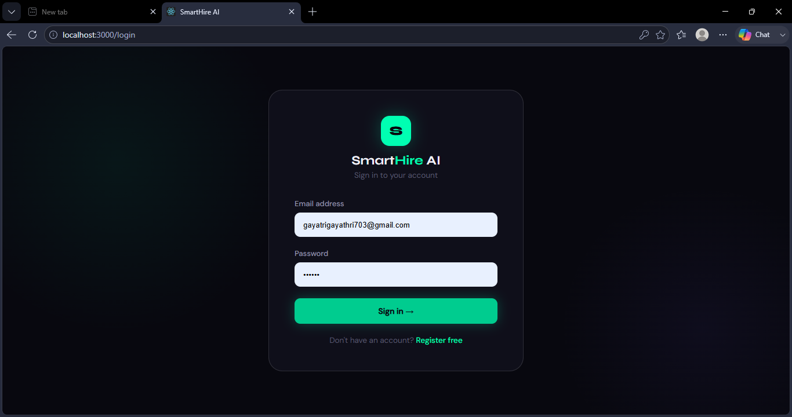
</td>
<td width="50%">
  <b>🏠 Dashboard</b><br/>
  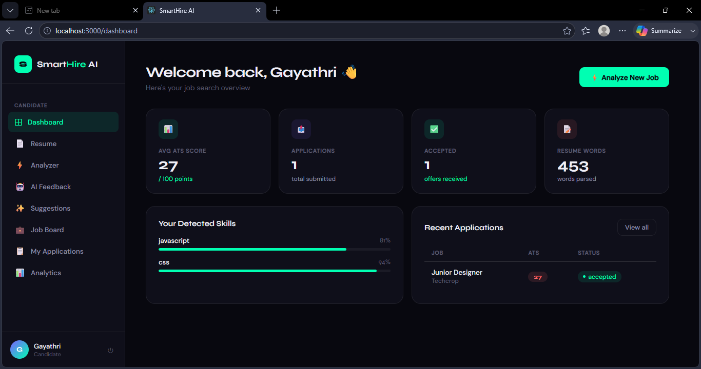
</td>
</tr>
<tr>
<td width="50%">
  <b>📄 Resume Upload & Auto-Parsing</b><br/>
  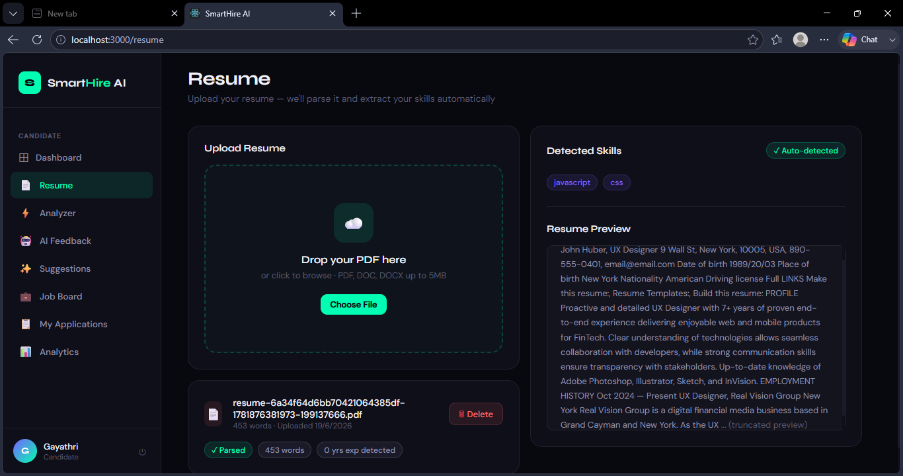
</td>
<td width="50%">
  <b>⚡ Job Match Analyzer — Real-Time ATS Scoring</b><br/>
  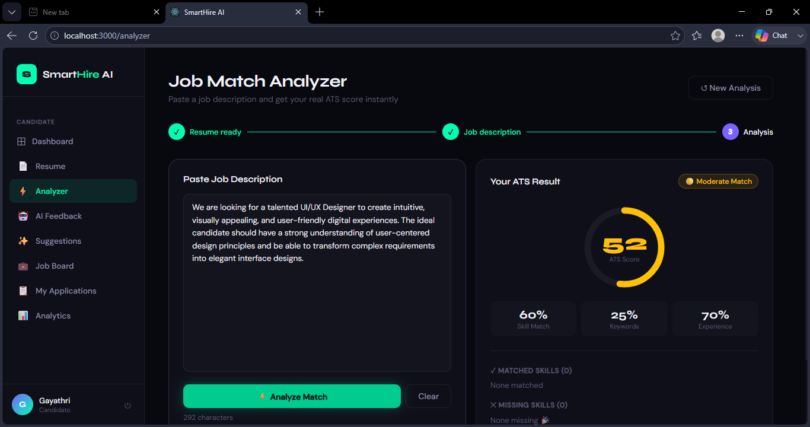
</td>
</tr>
<tr>
<td width="50%">
  <b>💼 Job Board with Advanced Filters</b><br/>
  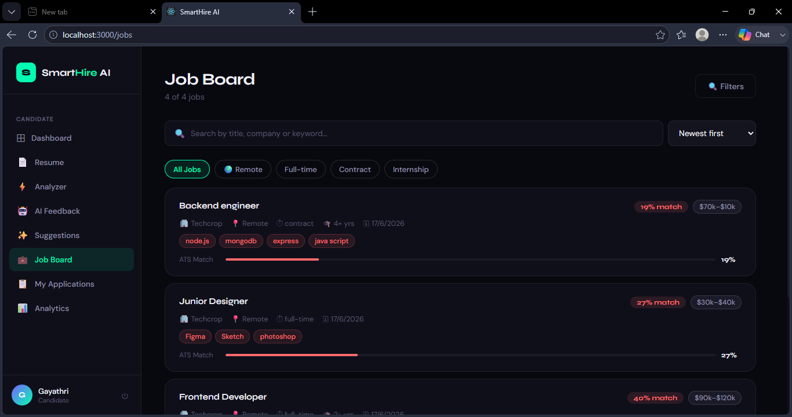
</td>
<td width="50%">
  <b>📋 My Applications — Status Tracking</b><br/>
  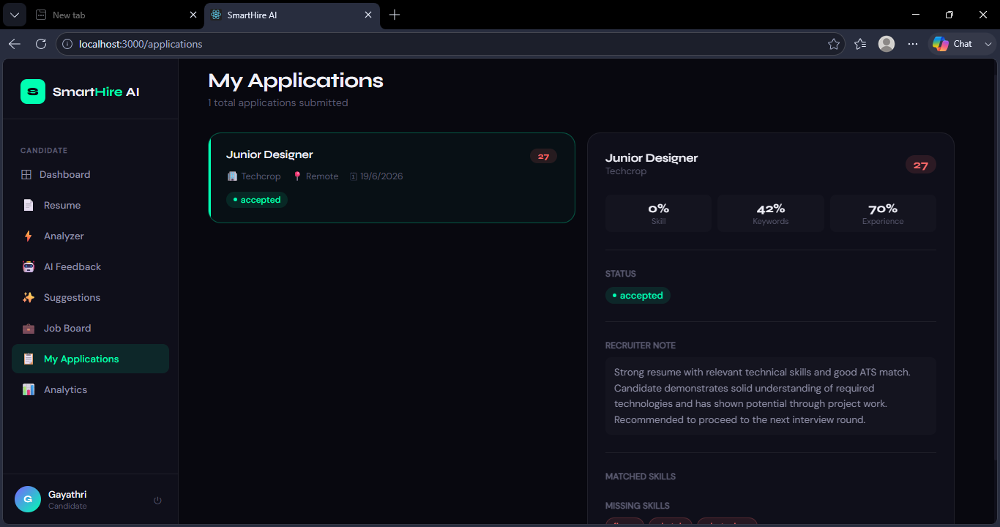
</td>
</tr>
<tr>
<td width="50%">
  <b>📊 Analytics — Score Trends & Skill Gaps</b><br/>
  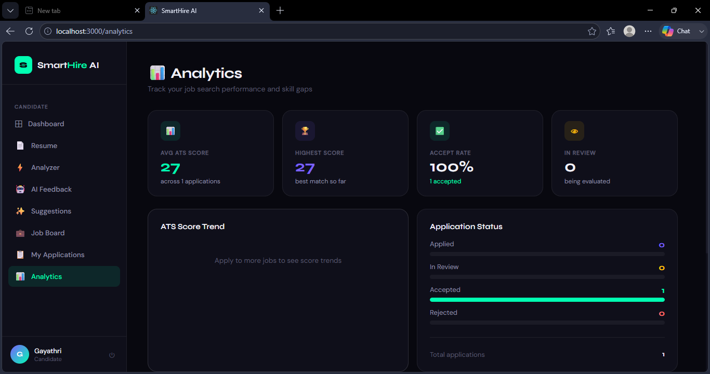
</td>
<td width="50%">
  <b>📥 Downloadable ATS Report</b><br/>
  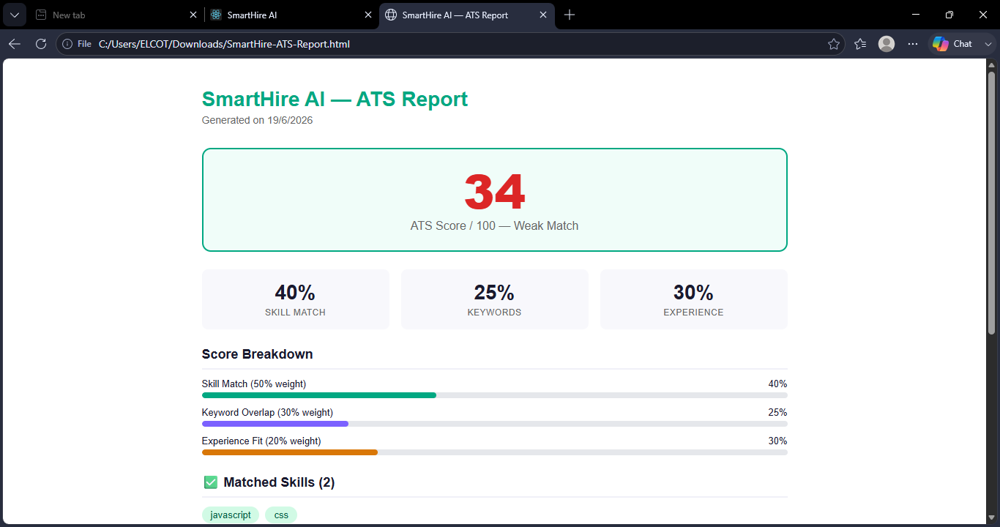
</td>
</tr>
<tr>
<td colspan="2">
  <b>🤖 AI Resume Feedback <i>(Code complete — pending OpenAI billing)</i></b><br/>
  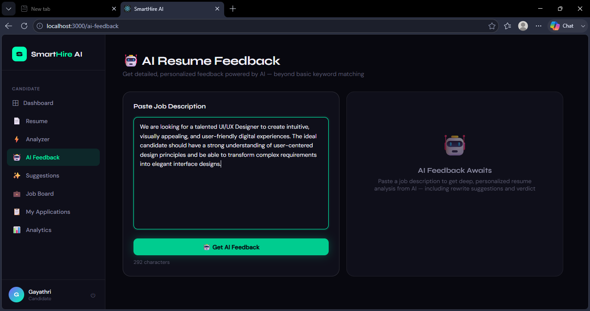
</td>
</tr>
</table>

### 🏢 Recruiter Experience

<table>
<tr>
<td width="50%">
  <b>🔐 Recruiter Login</b><br/>
  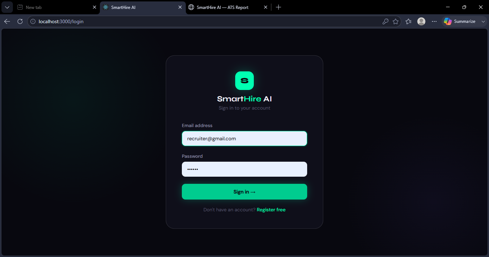
</td>
<td width="50%">
  <b>➕ Post a New Job</b><br/>
  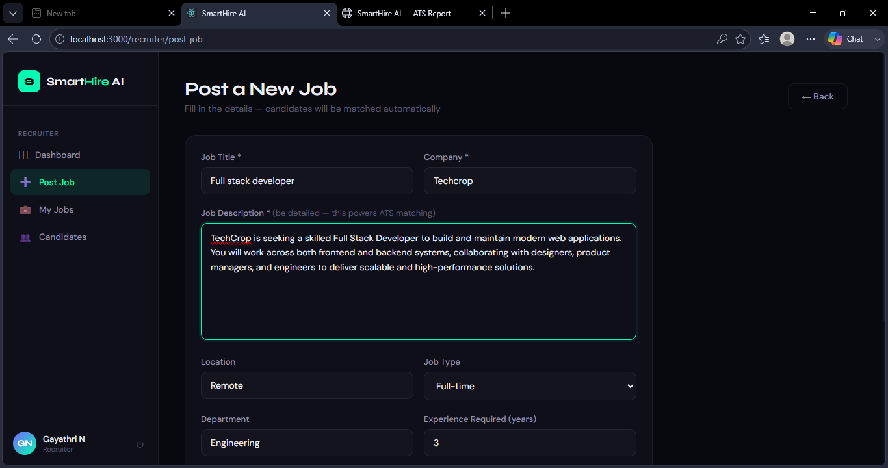
</td>
</tr>
<tr>
<td width="50%">
  <b>🗂️ Manage Posted Jobs</b><br/>
  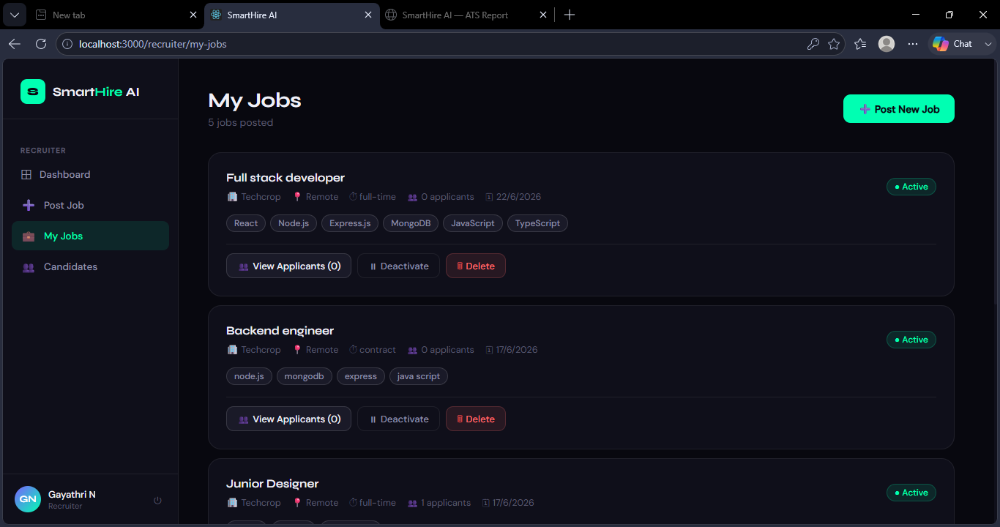
</td>
<td width="50%">
  <b>👥 Candidate Evaluation — ATS Breakdown per Applicant</b><br/>
  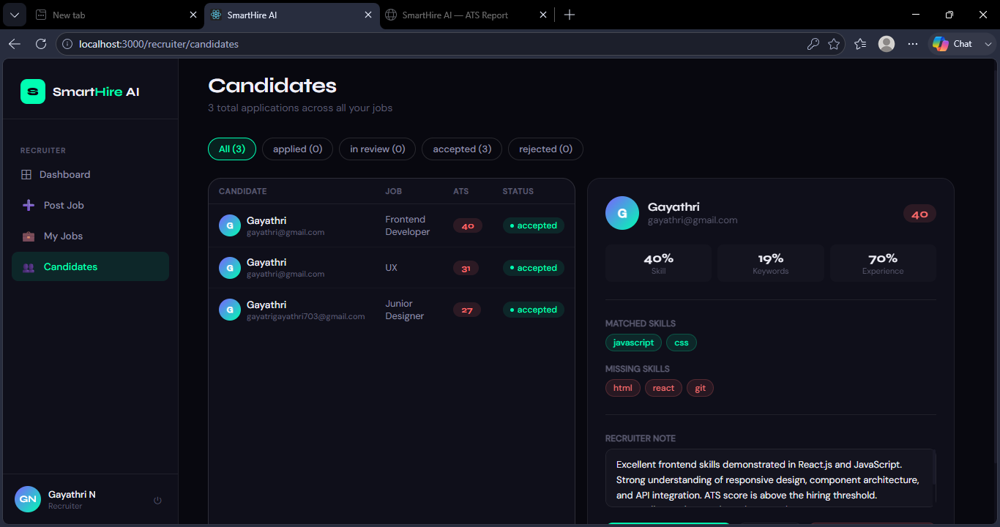
</td>
</tr>
</table>

### 📱 Mobile Responsive View

> SmartHire AI is fully responsive — candidates and recruiters get the complete feature set on any device.

<div align="center">
  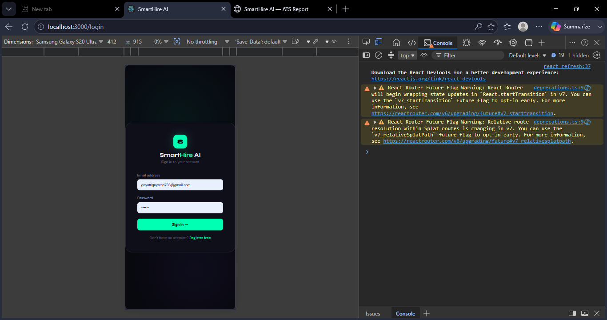
</div>

---

## ✨ Features

### 👤 For Candidates
- 🔐 Secure registration & login (JWT + bcrypt)
- 📄 PDF resume upload with automatic text extraction & skill detection (60+ keywords)
- ⚡ Instant ATS analysis against any pasted job description
- 🎯 Matched vs. missing skills, visually color-coded
- 💡 Actionable improvement suggestions
- 📥 One-click downloadable ATS report (branded HTML)
- 💼 Searchable job board with live match scores per listing
- 🔍 Advanced filters — location, salary range, minimum ATS score, job type
- 📋 Application tracking with real-time status updates
- 📊 Personal analytics — score trends, skill-gap charts, application funnel
- 📧 Automatic email notifications when a recruiter responds

### 🏢 For Recruiters
- ➕ Post jobs with structured requirements (skills, salary, experience level)
- 🗂️ Manage active/inactive postings
- 👥 View every applicant ranked by ATS score
- 🔬 Drill into any candidate's full skill breakdown
- ✅ Accept / 👁️ Review / ❌ Reject with one click
- 📝 Attach recruiter notes — auto-included in candidate's email
- 📈 Recruiter dashboard with hiring funnel metrics

### 📱 Platform
- Fully responsive across Desktop, Tablet, and Mobile

---

## 🧠 The ATS Scoring Algorithm

This isn't a random number generator — it's a real weighted matching engine:

```
ATS Score = (Skill Match × 50%) + (Keyword Overlap × 30%) + (Experience Fit × 20%)
```

**Skill Match** — Detects 60+ technical skills (languages, frameworks, cloud platforms, tools) in both the resume and job description, then calculates overlap.

**Keyword Overlap** — Strips stop-words and compares meaningful vocabulary between resume and job posting — the same literal-matching behavior real ATS software uses.

**Experience Fit** — Extracts years of experience from both documents (handles formats like "5+ years" and "2020–Present") and scores how closely they align.

The result: a score that moves predictably as relevant skills are added — validated through side-by-side testing during development, where adding matching keywords raised scores in controlled before/after comparisons.

---

## 🛠 Tech Stack

<div align="center">

| Frontend | Backend | Database | Security & Auth | File & Email | Deployment |
|:---:|:---:|:---:|:---:|:---:|:---:|
|  |  |  |  |  |  |
| React Router |  | Mongoose ODM |  | pdf-parse |  |
| Axios | | | | Nodemailer |  |
| Custom CSS (responsive, dark theme) | | | | | |

</div>

---

## 📂 Project Workflow

```
Candidate Uploads Resume (PDF)
        │
        ▼
Text Extracted (pdf-parse) + Skills & Experience Auto-Detected
        │
        ▼
Resume Data Saved to MongoDB Atlas
        │
        ▼
Candidate Pastes Job Description  ──OR──  Browses Job Board
        │
        ▼
ATS Engine Calculates Weighted Score (Skills 50% + Keywords 30% + Experience 20%)
        │
        ▼
Candidate Sees Score, Matched/Missing Skills, Suggestions
        │
        ▼
Candidate Applies with One Click (ATS Score Auto-Attached)
        │
        ▼
Recruiter Reviews via Protected Dashboard (JWT Auth)
        │
        ├──► 👁️ In Review
        │
        ├──► ✅ Accepted ──► Email Notification Sent to Candidate
        │
        └──► ❌ Rejected ──► Email Notification Sent to Candidate
```

---

## 📊 Project Modules

| Module | Description | Status |
|---|---|:---:|
| 🔐 Authentication System | Register/login as Candidate or Recruiter — JWT + bcrypt | ✅ Complete |
| 📄 Resume Management | PDF upload, text extraction, auto skill & experience detection | ✅ Complete |
| 🧠 ATS Matching Engine | Weighted scoring: skills × 50% + keywords × 30% + experience × 20% | ✅ Complete |
| 💼 Job Board | Search, filter by type/location/salary/ATS score, sort, live score per card | ✅ Complete |
| 📋 Application System | One-click apply, status tracking (Applied → In Review → Accepted/Rejected), withdraw | ✅ Complete |
| 🏢 Recruiter Panel | Post/manage jobs, view applicants by ATS rank, accept/reject/notes | ✅ Complete |
| 📊 Analytics Dashboard | Score trends, status breakdown, skill-gap chart, score distribution | ✅ Complete |
| 💡 AI Suggestions Engine | Rule-based tips, score breakdown visualization, matched/missing skills | ✅ Complete |
| 📥 PDF Report Export | Branded downloadable HTML report with score, charts, skill analysis | ✅ Complete |
| 📧 Email Notifications | Auto-email on accept/reject/review with recruiter notes included | ✅ Complete |
| 📱 Responsive Design | Mobile, tablet, and desktop optimized | ✅ Complete |
| 🚀 Deployment | Frontend on Vercel · Backend on Render · Database on Atlas | ✅ Complete |
| 🤖 AI Resume Feedback | OpenAI-powered feedback — code complete, pending API billing | ⏸️ Paused |

---

## ⚙️ Installation

### Prerequisites
- Node.js ≥ 18
- MongoDB Atlas account (free tier works)
- Gmail account with App Password enabled

```bash
# 1. Clone the repositories
git clone https://github.com/gayathri703-ok/Smart-Hire-AI-Backend.git
git clone https://github.com/gayathri703-ok/Smart-Hire-AI-Frontend.git

# 2. Install backend dependencies
cd Smart-Hire-AI-Backend && npm install

# 3. Install frontend dependencies
cd ../Smart-Hire-AI-Frontend && npm install

# 4. Create your .env file in the backend root (see below)

# 5. Run both servers
# Terminal 1 — Backend
cd Smart-Hire-AI-Backend && npm run dev      # → http://localhost:5000

# Terminal 2 — Frontend
cd Smart-Hire-AI-Frontend && npm start       # → http://localhost:3000
```

---

## 🔐 Environment Variables

Create a `.env` file inside the `Smart-Hire-AI-Backend` root:

```env
PORT=5000
MONGO_URI=your_mongodb_atlas_connection_string
JWT_SECRET=your_random_secret_key
JWT_EXPIRE=7d
NODE_ENV=development
EMAIL_USER=your_gmail_address
EMAIL_PASS=your_gmail_app_password
```

> ⚠️ **Never commit your real `.env` to GitHub.** It is already listed in `.gitignore`.

---

## 🎯 Skills Demonstrated

- **Frontend Development** — React component architecture, React Router, responsive dark-themed UI
- **Backend Development** — RESTful API design with Express.js, file handling with Multer
- **Database Management** — MongoDB schema design, Mongoose ODM, Atlas cloud hosting
- **Algorithm Design** — custom weighted multi-factor ATS scoring engine built from scratch
- **Security** — JWT authentication, bcrypt password hashing, role-based route middleware
- **DevOps & Deployment** — multi-repo CI pipeline, Vercel + Render production setup, cross-platform debugging

---

## 🔮 Future Enhancements

- [ ] 🤖 AI-powered resume feedback via OpenAI (code complete — pending API billing)
- [ ] 🔔 In-app notification center alongside email
- [ ] 📤 Export candidate shortlist as CSV for recruiters
- [ ] 🌙 Light mode theme toggle
- [ ] 🌐 Multi-language support

---

## 👩‍💻 Author

**Gayathri** — Full-stack project built end-to-end: backend API, React frontend, ATS scoring algorithm, email pipeline, deployment, and production debugging across Windows/Linux environments.

[](https://github.com/gayathri703-ok)

---

## 📄 License

This project is built for educational and portfolio purposes.

---

<div align="center">

### 🚀 SmartHire AI

*Closing the ATS black box — one transparent score at a time.*

**⭐ If this project helped you understand ATS systems or full-stack deployment, star the repo!**

</div>